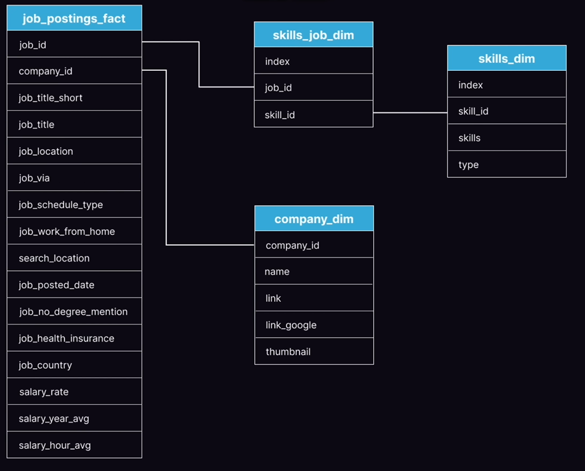

# SQL Data Job Analytics

This project analyzes how technical skills relate to compensation across Data Analyst and Data Scientist roles, using SQL for all data work and Power BI for visualization. The core idea was to stop treating the job market as a flat list and instead segment it into salary tiers to see how skill value actually changes depending on where in the market you're looking.

📄 [View Full Analysis Report](Project/Assets/Skill%20Economics%20Report.pdf)

---

## Tech Stack

- **PostgreSQL** — primary database and query engine
- **SQL** — window functions, CTEs, aggregations, salary segmentation logic
- **Power BI** — interactive dashboard with tier and job title filters
- **VS Code** — development environment
- **Git & GitHub** — version control

---

## Project Structure

```
Project/
├── Assets/
│   ├── ERD.png
│   ├── Dashboard preview.png
│   └── Skill Economics Report.pdf
├── Dashboards/
│   └── Skill Economics.pbix
├── SQL/
│   ├── Exploratory Queries/
│   │   ├── 1_Top_Paying_jobs.sql
│   │   ├── 1.1_Top_25%_paying_jobs.sql
│   │   ├── 1.2_Bottom_75%_paying_jobs.sql
│   │   ├── 2_Top_Paying_skills.sql
│   │   ├── 2.1_Top_Paying_skills_for_Top_25%.sql
│   │   └── 2.2_Top_Paying_skills_for_bottom_75%.sql
│   └── master_query.sql
└── README.md
```

---

## How It Works

The analysis is built around a single master query (`master_query.sql`) that handles all ranking and segmentation. It uses `ROW_NUMBER()` to identify the top 100 highest-paying roles per job title, and `NTILE(4)` to split the remaining market into salary quartiles — both partitioned by job title to keep Data Analyst and Data Scientist results separate.

All three tiers feed into a final `UNION ALL` which is what the Power BI dashboard connects to. The exploratory queries in the `Exploratory Queries/` folder were used during the investigation phase before the logic was consolidated into the master query.

---

## Database Schema



The dataset uses four tables: `job_postings_fact` for job-level salary data, `skills_job_dim` as the many-to-many bridge between jobs and skills, `skills_dim` for standardized skill names, and `company_dim` for company metadata.

---

## How to Use

1. Clone the repo
2. Set up a PostgreSQL database and load the schema
3. Run `master_query.sql` to generate the full tiered dataset
4. Open `Skill Economics.pbix` in Power BI Desktop and connect it to your database

The exploratory queries can be run individually — they were written and executed in order during the project and are numbered accordingly.

---

## Full Analysis

The findings, methodology, validation checks, and tier-by-tier breakdown are all documented in the project report linked at the top of this page.
